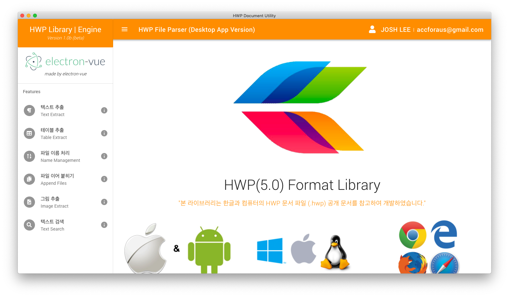
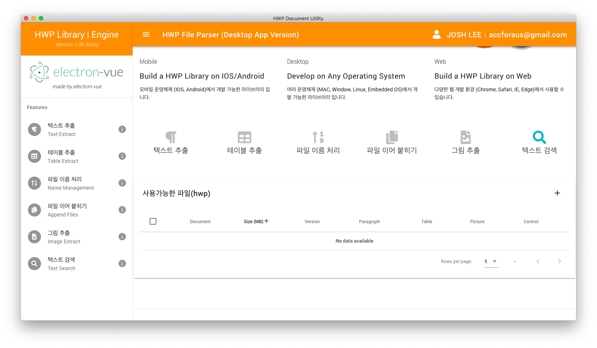
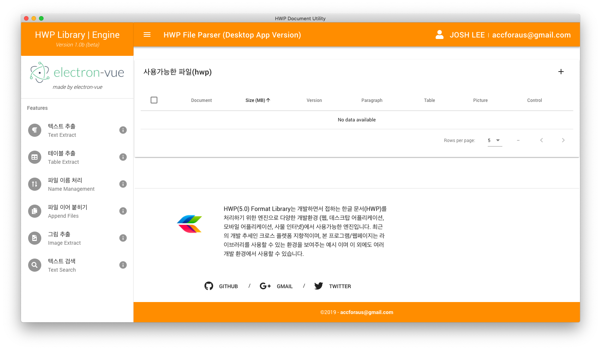

# libhwp-electron

이 프로젝트는 [libhwp]()와 [libhwp-server]()을 이용하여 만든 간단한 한글 파일 리더기 입니다.

> Developed by Vue.js & Vuetify & vue-electron

## Warning

This project is too simple to service for another project.\
Just use reference how to ues [libhwp](https://github.com/accforaus/libhwp)

enjoy!

## Screen Shots





## Build Setup

``` bash
# install dependencies
npm install

# serve with hot reload at localhost:9080
npm run dev

# build electron application for production
npm run build
```

---


## Services

- `Text Extraction` - extract normal text in selected file
- `Table Extraction` - extract table in selected file
- `File Name Management` - manage name in multiple selected files
- `File Attachment` - attach multiple selected files
- `Image Extraction` - extract images in selected file
- `Text Searching` - searching text in specific directory